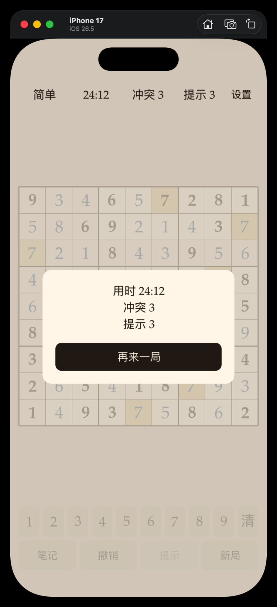
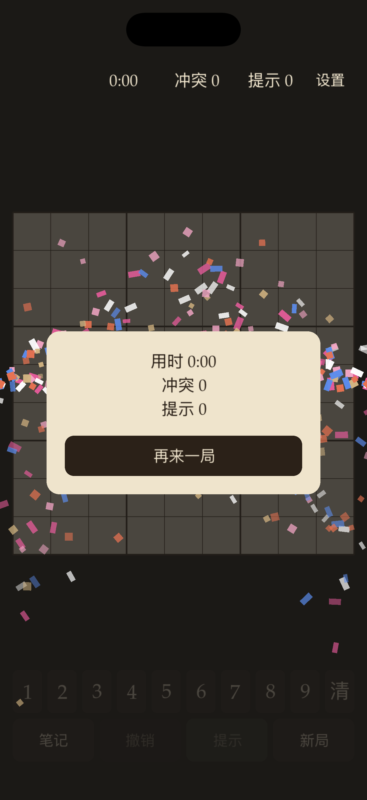

# 数独 / shudu

iOS 与 macOS 上的标准 9×9 数独，SpriteKit 绘制，两端共用同一套逻辑。

  
  

## 功能

- 随机生成唯一解题，简单 / 中等 / 困难
- 每局提示次数：简单 3、中等 2、困难 1
- 笔记、撤销 / 重做、计时、行列宫冲突高亮
- 跟随系统、日间、夜间三种外观（设置页切换）
- 过关时左右两侧持续喷彩屑
- 适配 iPhone 安全区（灵动岛、Home 指示条）

## 运行

用 Xcode 打开 `shudu.xcodeproj`，选 scheme：

- **shudu iOS**（iPhone / iPad）
- **shudu macOS**

需要较新的 Xcode（工程部署目标为 iOS / macOS 26.5）。

## 玩法

1. 选难度开局。
2. 点格子，再用底部 1–9 填数；「笔记」开关写候选。
3. 「提示」填入一格正确答案，用完即禁用。
4. 满盘且无冲突即过关。

设置里的「预览庆祝」可直接看过关动画，不必先通关。

## 技术

- 生成与求解：位掩码回溯 + 唯一解校验
- 难度：按 Naked / Hidden Single、数对、宫线锁定等人类手法评级
- 引擎与对局状态为纯 Swift，可用 `swift test --package-path shuduTests` 跑单测
